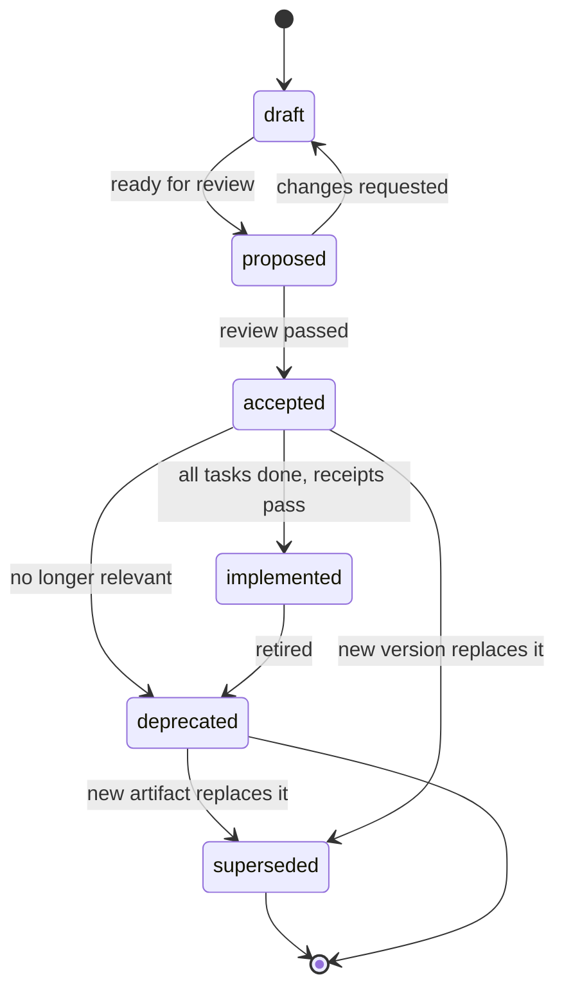

# Lifecycle

Every IDD artifact (intent, spec, plan, ADR) moves through a fixed state machine. The `status:` field in frontmatter records the current state. The validator does not check transitions; it checks only the per-state conditions marked "Validator-checked" below. All other gates are human-enforced.

## States

## State Meanings

| State | Meaning | Editable? |
|---|---|---|
| `draft` | Work in progress. | Freely. |
| `proposed` | Open for review. | With review comments. |
| `accepted` | ID locked. Content frozen except for patch versions (clarifications only). | Bump minor/major via new version. |
| `implemented` | All satisfying tasks `done`; all 4 receipts pass. | No (version bumps create new spec). |
| `deprecated` | Retired. Read-only history. | No. |
| `superseded` | Replaced by a new artifact. | No. `superseded-by:` points to replacement. |

## Gates

- `draft -> proposed`: frontmatter schema passes. Validator-checked on every run, in every state.
- `proposed -> accepted`:
  - For specs: ambiguity pre-check (`/idd-ambiguity`) passes.
  - For plans: has at least one task.
- `accepted -> implemented`: all tasks `done`, four PR receipts present. Validator-checked: an `implemented` spec must have all tasks `done`. Receipt presence is checked for every spec, any status, only with `--receipts`.
- `accepted -> deprecated`: explicit decision, `superseded-by:` set. Validator-checked: a `deprecated` artifact must have `superseded-by:`.
- `* -> superseded`: another artifact exists with `supersedes:` pointing here.

## Version Bumps (Specs Only)

- **patch** (`1.0.0 -> 1.0.1`): clarification only. No behavior change. Same `compiled-hash` after rebuild.
- **minor** (`1.0.0 -> 1.1.0`): additive requirement. Existing requirements unchanged.
- **major** (`1.0.0 -> 2.0.0`): breaking change. Contracts version in lockstep.

## Rules

- `deprecated` artifacts MUST have a `superseded-by:` value, or a one-line reason in the frontmatter `deprecated-reason:` field.
- Content of an `accepted` artifact can only change under a patch version bump (clarification). Bigger changes require a new version or a superseding artifact.
- ADRs are immutable from the moment they are created. If a decision needs to change, write a new ADR that supersedes the old one.

## Auditing

Run `grep -r "status: draft" intents/ specs/ plans/` to find stalled work.
Run `grep -r "status: deprecated" .` and check each has a `superseded-by:` or `deprecated-reason:`.
