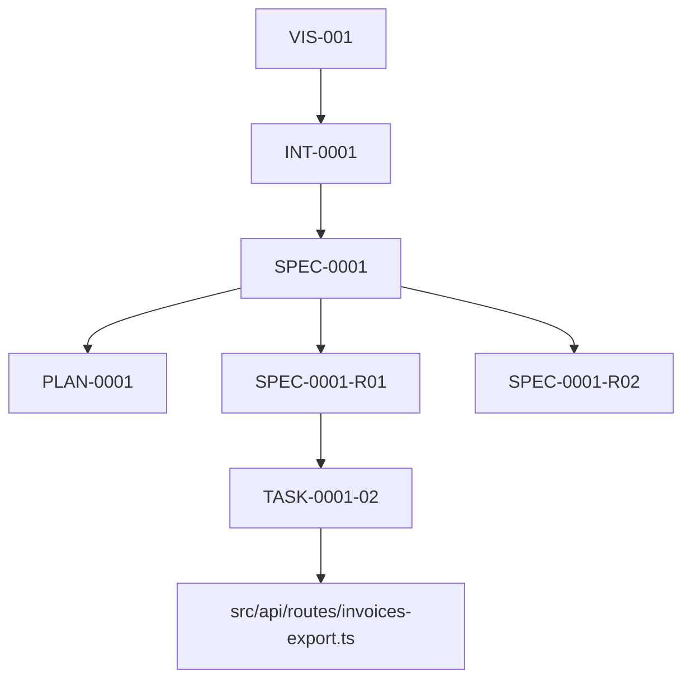

# Traceability

## The Chain

```
VIS-### -> INT-#### -> SPEC-#### -> SPEC-####-R## -> TASK-####-## -> file.ts -> test("SPEC-####-R##: ...")
```

Every link is a `parent:` / `implements:` / `satisfies:` / `produces:` field or a test name. The chain is machine-checkable.

## How Links Are Declared

| Layer | Field | Points to |
|---|---|---|
| Intent | `parent:` | Vision |
| Spec | `parent:` | Intent |
| Plan | `implements:` | Spec |
| ADR | `context:` | Plan |
| Task | `satisfies:` | Requirement IDs (`SPEC-####-R##`) |
| Task | `produces:` | File paths |
| Task | `emits:` | Observability signal names |
| Test | name starts with | `SPEC-####-R##:` |

## Auto-Generated Traceability

Run `node verify/validator.mjs`. It writes:

- `verify/traceability.yaml` - flat list of nodes and edges.
- `verify/traceability.mmd` - Mermaid graph. Renders in GitHub / VSCode / most Markdown viewers.

Example (from the worked example):



Orphans and broken links appear as dangling nodes or edges pointing to nothing.

## Greppable IDs

All IDs are plain text. To trace any requirement:

```bash
grep -r "SPEC-0001-R03" .
# finds: spec, acceptance.yaml, tasks.yaml, test files, code comments, commit messages
```

This is the single most valuable property of IDD: no tooling required to follow a requirement from intent to production.

## CI Enforcement

The validator fails the PR if:

- Any requirement is not covered by at least one task.
- Any referenced ID does not resolve.
- Any produced file is missing.
- Any observability signal declared in `observability.yml` has no emitting task.
- Any `compliance.yml` PII field has no governing requirement.
- Any state machine transition has no test.
- Any `compiled-hash:` does not match the body hash on rebuild.

## Manual Audit

Quarterly, run:

```bash
grep -rE "SPEC-[0-9]{4}-R[0-9]{2}" tests/ | wc -l
ls specs/SPEC-*/spec.md | xargs grep -E "SPEC-.*-R[0-9]{2}" | wc -l
```

Requirements without tests or tests without requirements are drift.
