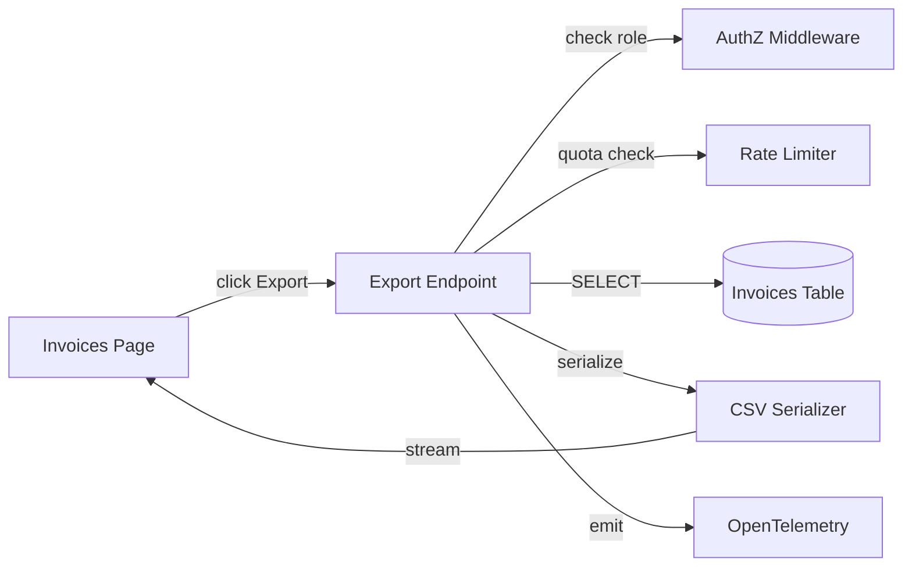

# Architecture

Export is a synchronous read-only endpoint. Authorization middleware runs first, rate limiter second, then a single DB query against the invoices table, then CSV serialization and streaming to the client. No queue, no worker, no storage layer. Keeps the hot path under 800ms at p95 (SPEC-0001-R01).

The serializer is a pure function: `Invoice[] -> string`. Excludes `customer_email` unconditionally (SPEC-0001-R06) so there is no "role-dependent serialization" code path to get wrong. Amount formatting uses `Intl.NumberFormat` with fixed options (SPEC-0001-R04).

Rate limiting uses a fixed-window counter in Redis, keyed by `user_id`. Window is 60 seconds, quota is 10. On exceed, returns 429 with `Retry-After` set to the remainder of the current window (SPEC-0001-R05).

# Sequencing

1. **Contract tests first** - stand up `/invoices/export` returning 501 Not Implemented. Contract tests (schemathesis) pass against OpenAPI shape. Exit: shape matches contract.
2. **AuthZ middleware** - TASK-0001-01. Structural change only; no behavior yet. Tests cover SPEC-0001-R03 (403 for non-finance).
3. **DB query** - TASK-0001-02. Read invoices, no serialization yet.
4. **Serializer** - TASK-0001-03, 0001-04, 0001-05. Pure function covering SPEC-0001-R02, R04, R06. Golden-file test against `expected/three-invoices.csv`.
5. **Rate limiter** - TASK-0001-06. Redis-backed, SPEC-0001-R05.
6. **Observability wiring** - TASK-0001-07. Emit metrics/logs/traces declared in `observability.yml`.
7. **Integration** - TASK-0001-08. End-to-end Gherkin scenarios pass.

# Risks and Rollback

| Risk | Likelihood | Impact | Mitigation |
|---|---|---|---|
| Large accounts OOM on serialization | low | high | Stream CSV row-by-row; 10k row limit with pagination v2 |
| Redis unavailable | low | medium | Fail open (allow export), but alert on `rate_limiter_unavailable_total` |
| Export blocked by browser for large files | low | low | Set `Content-Disposition: attachment; filename=invoices.csv` |
| Wrong decimal separator in locale | medium | high | Use fixed `Intl.NumberFormat("en-US", {...})`, not user locale |

**Rollback:** feature flag `EXPORT_CSV_ENABLED`. Default off. Flip on per-account after smoke test. If any SLO breach (latency, error rate), flip off. Endpoint returns 503 with informative message; UI hides button.
